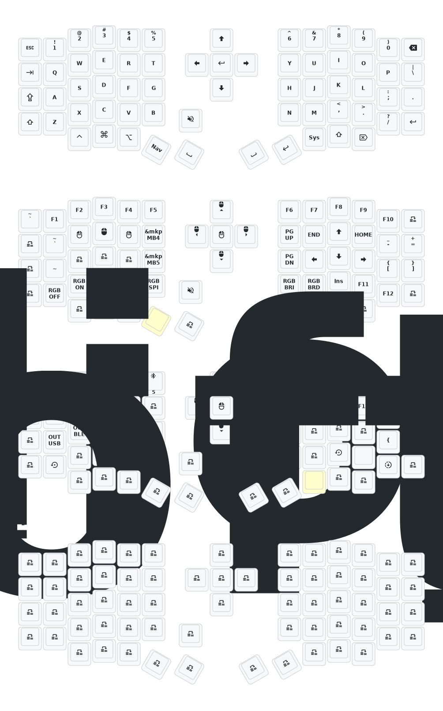

# ZMK Sofle (dongle mode) config

This repository has the ZMK configuration for an **Eyelash Sofle** split keyboard running in **dongle/receiver mode**. It includes the shield definitions, keymap, and a GitHub Actions workflow that builds the firmware automatically.

## Hardware

- Controller board: `nice_nano_v2`
- SoC: Nordic nRF52840

## What this repo builds

GitHub Actions builds these firmware files (see [build.yaml](build.yaml)):

| Firmware file | Description |
|---|---|
| `eyelash_sofle_central_dongle_oled` | The **dongle/receiver** (ZMK central, with OLED display) |
| `eyelash_sofle_peripheral_left` | Left half |
| `eyelash_sofle_peripheral_right` | Right half |
| `settings_reset` | Clears stored settings and pairings |

## Quick start (GitHub Actions)

1. Fork this repository.
2. Go to **Actions** and enable workflows if GitHub asks.
3. Edit the keymap or use the [Keymap Editor](https://nickcoutsos.github.io/keymap-editor/) web UI (requires GitHub login).
4. Commit your changes. GitHub Actions will build the firmware automatically.
5. Open the latest **Build ZMK firmware** run and download the artifact.
6. Flash the `.uf2` file to the dongle, left half, or right half as needed (see below).

## How to flash firmware

1. Connect the target device (dongle, left half, or right half) to your computer via USB.
2. Press the reset button **twice quickly**. A USB drive will appear on your computer (usually named `NICENANO`).
3. Copy the correct `.uf2` file to the root of that drive. Do not put it inside a folder.
4. The device restarts automatically once the file is copied.

For first-time setup or if the devices stopped pairing with each other, follow this order:

1. Flash `settings_reset.uf2` to **all three** devices: dongle, left half, right half.
2. Then flash the normal firmware to each device: dongle firmware to the dongle, left firmware to the left half, right firmware to the right half.
3. Power on all three devices. They will pair automatically.

> Note: `settings_reset` does not distinguish left from right. The same file works on any device.

## Project structure

```
zmk-sofle-dongle/
├── build.yaml                               # Which shields/boards get built by CI
├── keymap_drawer.config.yaml                # Controls how the keymap diagram is rendered
├── zephyr/
│   └── module.yml                           # Registers this repo as a Zephyr module (don't touch)
├── config/                                  # ← Files you edit
│   ├── eyelash_sofle_central_dongle.keymap  # Your keymap
│   ├── eyelash_sofle_central_dongle.conf    # Feature flags and config overrides
│   ├── eyelash_sofle_central_dongle.json    # Generated by Keymap Editor -> don't hand-edit
│   └── west.yml                             # Pins the ZMK version and extra modules
├── boards/shields/eyelash_sofle/            # Hardware definitions -> don't touch unless forking
│   ├── eyelash_sofle.dtsi                   # Shared hardware definition (matrix, sensors)
│   ├── eyelash_sofle-layouts.dtsi           # Physical key layout definition
│   ├── eyelash_sofle.keymap                 # Default/fallback keymap (overridden by config/)
│   ├── eyelash_sofle.zmk.yml                # Shield metadata
│   ├── Kconfig.defconfig                    # Default Kconfig values for the shield
│   ├── Kconfig.shield                       # Shield name registration
│   ├── eyelash_sofle_central_dongle.overlay # Dongle-specific pin/device config
│   ├── eyelash_sofle_central_dongle.conf    # Dongle-specific default Kconfig
│   ├── eyelash_sofle_peripheral_left.overlay  # Left half pin/device config
│   ├── eyelash_sofle_peripheral_left.conf     # Left half default Kconfig
│   ├── eyelash_sofle_peripheral_right.overlay # Right half pin/device config
│   └── eyelash_sofle_peripheral_right.conf    # Right half default Kconfig
├── keymap-drawer/                           # Auto-generated -> do not edit manually
│   ├── eyelash_sofle_central_dongle.svg     # Keymap diagram (shown below)
│   └── eyelash_sofle_central_dongle.yaml    # Intermediate YAML used to generate the SVG
└── .github/workflows/
    ├── build.yml                            # Builds firmware on each push
    └── draw.yml                             # Regenerates the keymap diagram SVG
```

> Files under `boards/shields/` define the hardware layer. Files under `config/` define your personal customizations. Only `config/` needs to be edited for normal use.

## Live keymap changes (ZMK Studio)

This repo supports **ZMK Studio**, which lets you change key assignments live without rebuilding or flashing firmware.

- Guide: [docs/zmk-studio.md](docs/zmk-studio.md)
- Official docs: https://zmk.dev/docs/features/studio

Note: once you start managing your keymap through ZMK Studio, future edits to the `.keymap` file will not take effect until you use **”Restore Stock Settings”** in ZMK Studio.

## Documentation

- [docs/dongle-usage.md](docs/dongle-usage.md): dongle setup, pairing, and placement
- [docs/keymap.md](docs/keymap.md): changing the keymap, flashing, and using the Keymap Editor

## Keymap diagram


